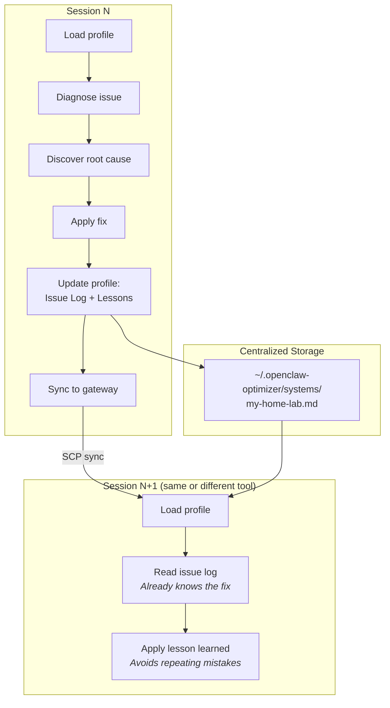

# OpenClaw Optimizer — Workflows & Architecture

Visual reference for how the skill operates. Each diagram maps to a section in `SKILL.md`.

---

## Architecture Overview

How the skill package, centralized data, and AI tools fit together.

The skill package lives in version control. Deployment profiles live in `~/.openclaw-optimizer/systems/` — centralized, outside git, shared across AI tools on the same machine.

---

## First-Run Bootstrap

*SKILL.md Section 11 — System Learning*

The skill is self-bootstrapping. When loaded by any AI tool for the first time on a machine, it sets up the centralized systems directory.

If the user declines, the skill still works — it just won't persist deployment knowledge between sessions.

---

## Session Lifecycle

*SKILL.md Section 11 — System Learning*

Every session follows this lifecycle: identify the deployment, load knowledge, assess the system, work, then persist what was learned.

The mandatory data collection step prevents the skill from making recommendations that duplicate existing automation or miss hidden drains (stuck delivery queues, stale cron jobs, etc.).

---

## Troubleshooting Flow

*SKILL.md Section 10 — Troubleshooting*

When diagnosing a problem, the skill follows a structured triage before making recommendations.

Every fix goes through the safety contract: exact command, expected impact, rollback command, user approval. All fixes are logged in the deployment profile for future reference.

---

## Model Failover Chain

*SKILL.md Section 2 — Model Routing Strategy*

How model requests flow through the failover chain and where problems occur.

**Key rule:** Direct-API providers (Anthropic, Google API key) go before proxy providers (KiloCode, OpenRouter) in the fallback chain. Proxies are single points of failure — when the proxy degrades, ALL models through it fail simultaneously.

When all providers timeout at once, the problem is almost never the providers. See the Troubleshooting Flow above and SKILL.md Sections 10b (event loop overload) and 10d (context bloat cascade).

---

## Agent Identity Audit

*SKILL.md Section 13 — Agent Identity Optimizer*

When auditing agent personality and identity files, the skill follows a structured process.

The full 36-check audit checklist and file role definitions are in `references/identity-optimizer.md`.

---

## System Learning Lifecycle

*SKILL.md Section 11 — System Learning*

How deployment knowledge accumulates and persists across sessions and tools.

Profiles are stored in `~/.openclaw-optimizer/systems/` — outside git, shared across all AI tools on the same machine. Cross-machine sync is manual via SCP after each session.
